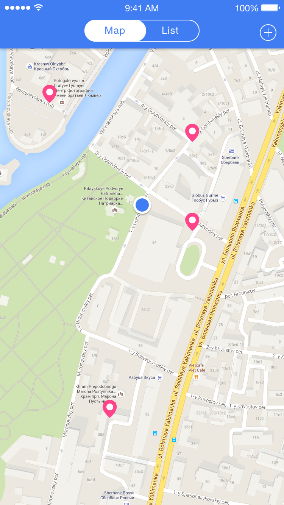
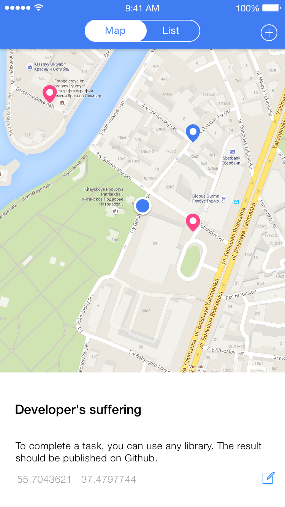
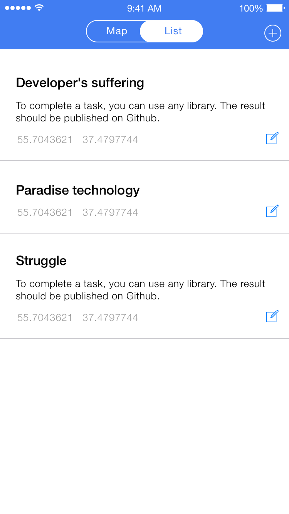
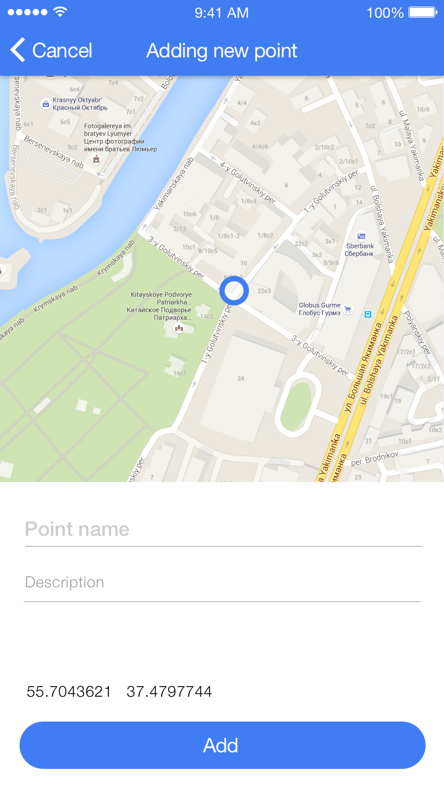
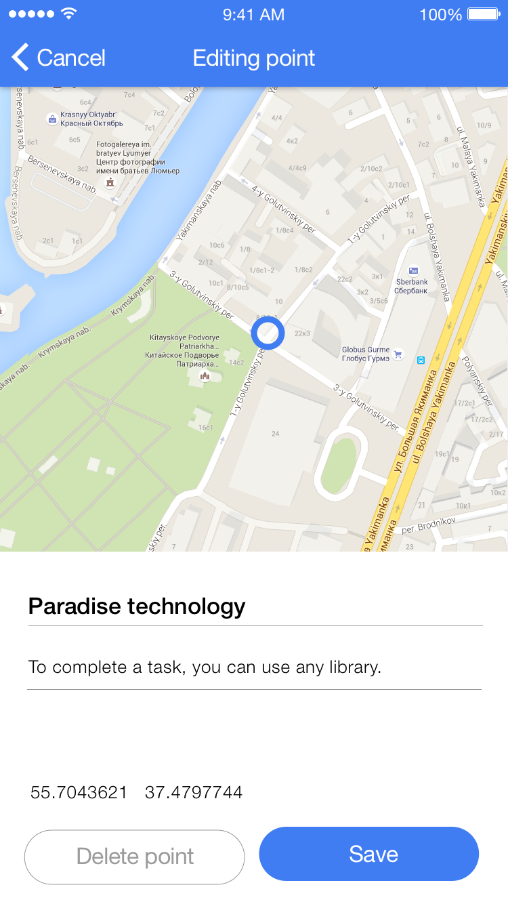
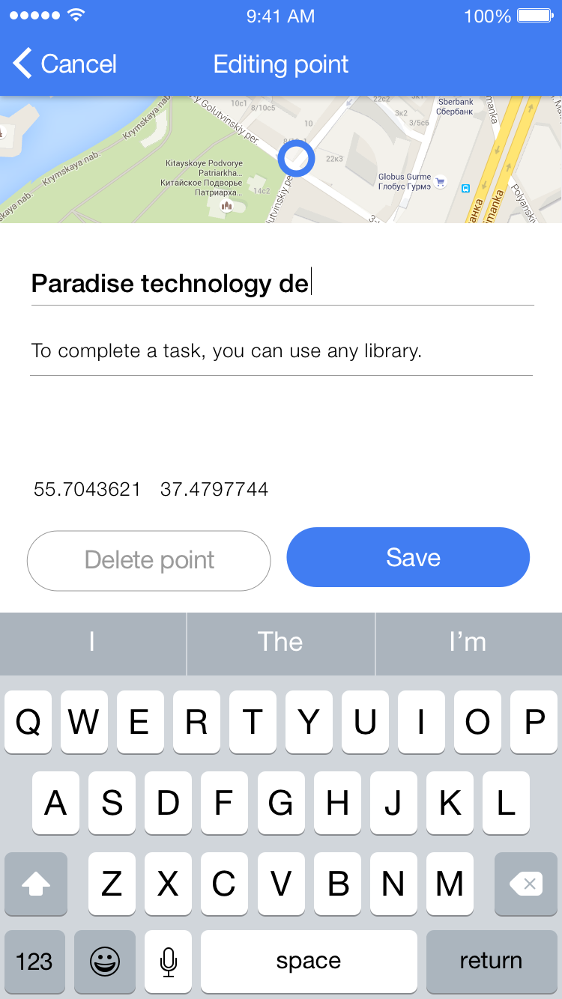

# Задание

Не обходимо разработать приложение для работы с набором точек. 
У кажой точки есть:

 - название (`title`);
 - необязательно описание (`desc`);
 - широта (`lat`);
 - долгота (`lng`).

Точки хранятся на сервере.

Примерные макеты экранов находятся в файле `mockup.sketch`.

## Экран просмотра точек

На экране просмотра точек отображаются все точки в режиме карты 
или в режиме списка.

Переход между режимом карты и списка должен осузествляться с
анимацией (любой, на выбор).

Для отображения карты можно использовать любую библиотеку.

Отображение описания должно адаптироваться к количеству строк
в тексте.



При нажатии на точку на карте с анимацией появляется
карточка точки.



В режиме списке:



При нажатии на `+` должен осуществляться переход к добавлению
новой точки. При нажатии на кнопку редактирования должен
осуществляться переход к экрану редактирования.

## Экран добавления точки



Ввод координт осуществляется перемещением карты.
После добавления точки должен произойти переход на предыдущий
экран, в списке или на карте добавленная точка должна
уже присутствовать.

## Экран редактирования точки

Экран полностью повторяет экран добавления точки, но есть
кнопка для удаления точки.






Для выполнения задания можно использовать любые библиотеки.
Результат нужно выложить на Github.

# Сервер
## Установить node.js

https://nodejs.org

## Запуск сервера

```bash
npm install
npm start
```

Сервер запускается на порту 3000.

## API
### Добавление точки

```
POST http://localhost:3000/points
Content-Type: application/json
```

```json
{ "title": "Point 1", "desc": "Cool point", "lat": 0.0, "lng": 0.0 }
```

### Получение всех точек

```
GET http://localhost:3000/points
```

### Получение одной точки

```
GET http://localhost:3000/points/:point_id
```

### Удаление точки

```
DELETE http://localhost:3000/points/:point_id
```

### Обновление точки

```
PUT http://localhost:3000/points/:point_id
Content-Type: application/json
```

```json
{ "title": "Point 1", "desc": "Cool point", "lat": 0.0, "lng": 0.0 }
```
